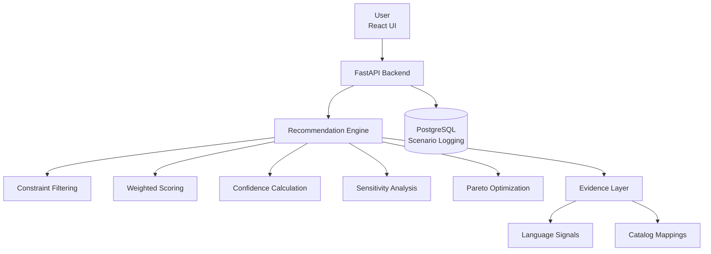

# **🚀 StackWise AI**

  

### **Explainable Tech Stack Decision Support System**


<p align="center">
  
  
  
  
  
  
  
  
  
  
</p>


----------

# **📌 Overview**

  

**StackWise AI**  is an  **explainable decision-support system**  that helps developers and teams choose the most suitable tech stack for their projects.

  

It uses:

-   constraint-based filtering
    
-   weighted multi-criteria scoring
    
-   confidence estimation
    
-   sensitivity analysis
    
-   Pareto trade-off evaluation
    

  

Built as a **modern full-stack application** with:

-   FastAPI backend
    
-   React + TypeScript frontend
    
-   PostgreSQL database
    

----------

# **⚠️ Important Note**

  

This project uses a **rule-based scoring engine combined with dataset-derived signals**.

  

👉 It is  **not a machine learning model yet**, but is designed to evolve into one (XGBoost / LightGBM ranking planned).

----------

# **🎯 Problem Statement**

  

Tech stack selection is often based on intuition, trends, or limited experience.

  

This leads to:

-   poor scalability decisions
    
-   unnecessary complexity
    
-   inconsistent system design
    

  

StackWise AI introduces a **structured, explainable approach** to:

-   compare multiple stack options
    
-   evaluate trade-offs
    
-   justify decisions transparently
    

----------

# **🧠 Key Features**

  

## **🔹 Tech Stack Recommendation**

  

Suggests:

-   programming language
    
-   backend framework
    
-   database
    
-   deployment strategy
    

----------

## **🔹 Constraint-Based Filtering**

  

Filters out invalid stacks based on:

-   project requirements
    
-   scalability constraints
    
-   operational preferences
    

----------

## **🔹 Weighted Scoring Engine**

  

Scores each option using:

-   team familiarity
    
-   ecosystem strength
    
-   scalability fit
    
-   operational complexity
    

----------

## **🔹 Confidence Score**

  

Quantifies reliability of recommendation using:

-   score separation
    
-   evidence strength
    
-   alignment with inputs
    

----------

## **🔹 Sensitivity Analysis**

  

Answers:

  

> “How stable is this decision if priorities change?”

----------

## **🔹 Pareto Frontier**

  

Highlights  **non-dominated options**  to visualize trade-offs:

-   performance vs simplicity
    
-   scalability vs ease-of-use
    

----------

## **🔹 Scenario Logging (PostgreSQL)**

-   stores evaluation history
    
-   enables comparison of past decisions
    

----------

# **🏗️ System Architecture**



----------

# **📂 Project Structure**

```
stackwise-ai/
├── backend/        # FastAPI backend
├── frontend/       # React frontend
├── engine/         # Recommendation logic
├── evidence/       # Dataset signals
├── database/       # PostgreSQL integration
├── catalog/        # Stack mappings (YAML)
├── pipelines/      # Data processing
├── data/           # Processed datasets
├── tests/          # Unit tests
```

----------

# **🖼️ Screenshots**

  


### 🏠 Home Page


  

### 📊 Results Page


  

### 📈 Analytics Dashboard


----------

# **⚙️ Tech Stack**

  

### **Backend**

-   FastAPI
    
-   Pydantic
    
-   Uvicorn
    

  

### **Frontend**

-   React
    
-   TypeScript
    
-   Vite
    
-   Tailwind CSS
    
-   Recharts
    

  

### **Data Processing**

-   Polars
    
-   Pandas
    
-   DuckDB
    

  

### **Database**

-   PostgreSQL
    
-   psycopg2
    

  

### **Testing**

-   Pytest
    

----------

# **🚀 Getting Started**

  

## **1️⃣ Clone**

```
git clone https://github.com/your-username/StackWise-AI.git
cd StackWise-AI
```

----------

## **2️⃣ Backend Setup**

```
python -m venv venv
source venv/bin/activate
pip install -r requirements.txt
```

Run:

```
uvicorn backend.main:app --reload
```

👉 http://127.0.0.1:8000/docs

----------

## **3️⃣ Database Setup**

```
CREATE DATABASE stackwise_ai;
```

```
psql -d stackwise_ai -f database/schema.sql
```

----------

## **4️⃣ Frontend Setup**

```
cd frontend
npm install
npm run dev
```

👉 http://localhost:5173

----------

# **🧪 Example Request**

```
{
  "project_type": "api",
  "team_languages": ["python"],
  "low_ops": true,
  "expected_scale": "medium"
}
```

----------

# **📤 Example Output**

```
{
  "winner": {
    "language": "python",
    "backend_framework": "fastapi",
    "database": "postgresql",
    "deployment": "render",
    "score": 0.82
  },
  "confidence": 0.78,
  "sensitivity": {
    "stability": 0.67
  },
  "pareto": [
    {"language": "python"},
    {"language": "go"}
  ]
}
```

----------

# **🧪 Testing**

```
pytest
```

----------

# **📊 Limitations**

-   Rule-based scoring (no ML yet)
    
-   Limited stack catalog
    
-   Simplified dataset signals
    

----------

# **🚀 Future Improvements**

-   ML-based ranking (XGBoost / LightGBM)
    
-   Feedback-driven learning
    
-   Cloud deployment
    
-   Authentication system
    
-   Advanced analytics
    

----------

# **👨‍💻 Author**

  

Aditya Singh

----------

# **📜 License**

  

MIT License

----------

# **⭐ Final Note**

  

This project focuses on:

-   **explainability over black-box decisions**
    
-   **structured engineering thinking**
    
-   **real-world trade-off analysis**
    

----------


