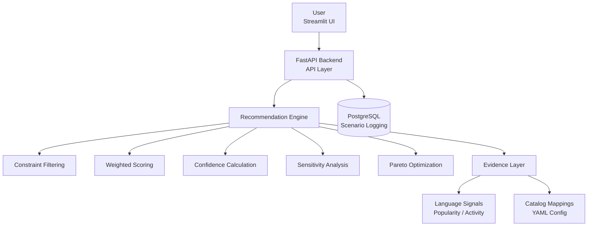

# **🚀 StackWise-AI**

  

### **Explainable Tech Stack Decision Support System**


  


  


  


  


  


  


  


  


----------

# **📌 Overview**

  

**StackWise-AI**  is an  **explainable decision-support system**  that helps developers choose an appropriate tech stack for their projects.

  

It evaluates options using:

-   constraint-based filtering
    
-   weighted multi-criteria scoring
    
-   confidence estimation
    
-   sensitivity analysis
    
-   Pareto trade-off evaluation
    

  

The system is built as a  **full-stack application**  with:

-   FastAPI backend
    
-   Streamlit frontend
    
-   PostgreSQL for scenario logging
    

----------

# **⚠️ Important Note**

  

This project uses a **rule-based scoring engine combined with dataset-derived signals**.

  

It is  **not a machine learning model yet**, but is designed to be extended with ML-based ranking in future versions.

----------

# **🎯 Problem Statement**

  

Choosing a tech stack (language, backend framework, database, deployment) is often based on intuition or trends.

  

This project aims to provide a  **structured, explainable approach**  to:

-   compare multiple stack options
    
-   evaluate trade-offs
    
-   understand why a choice is recommended
    

----------

# **🧠 Key Features**

  

## **🔹 1. Tech Stack Recommendation**

-   Suggests:
    
    -   programming language
        
    -   backend framework
        
    -   database
        
    -   deployment option
        
    

----------

## **🔹 2. Constraint-Based Filtering**

  

Removes invalid options based on:

-   operational constraints
    
-   scalability needs
    
-   project requirements
    

----------

## **🔹 3. Weighted Scoring Engine**

  

Each option is scored using:

-   team familiarity
    
-   ecosystem strength
    
-   scalability fit
    
-   operational complexity
    

----------

## **🔹 4. Confidence Score**

  

Indicates reliability of recommendation based on:

-   score gap between top options
    
-   dataset/evidence strength
    
-   team alignment
    

----------

## **🔹 5. Sensitivity Analysis**

  

Answers:

  

> “What happens if requirements change?”

  

Shows:

-   winner changes under different conditions
    
-   stability of decision
    

----------

## **🔹 6. Pareto Frontier**

  

Identifies  **non-dominated options**  to highlight trade-offs:

-   performance vs ecosystem
    
-   simplicity vs scalability
    

----------

## **🔹 7. Scenario Logging (PostgreSQL)**

-   Stores past evaluations
    
-   Enables review of previous decisions
    

----------

# **🏗️ System Architecture**



----------

# **🧱 Project Structure**

```
stackwise-ai/
├── backend/        # FastAPI backend
├── frontend/       # Streamlit UI
├── engine/         # Recommendation logic
├── evidence/       # Dataset signals
├── database/       # PostgreSQL integration
├── catalog/        # Stack mappings (YAML)
├── pipelines/      # Data processing scripts
├── tests/          # Unit tests
├── data/           # Processed + raw data
```

----------

# **⚙️ Tech Stack**

  

### **Backend**

-   FastAPI
    
-   Pydantic
    
-   Uvicorn
    

  

### **Frontend**

-   Streamlit
    
-   Requests
    

  

### **Data Processing**

-   Polars
    
-   Pandas
    
-   DuckDB
    
-   PyArrow
    

  

### **Database**

-   PostgreSQL
    
-   psycopg2
    

  

### **Testing**

-   Pytest
    

----------

# **🚀 Getting Started**

  

## **1️⃣ Clone the repository**

```
git clone https://github.com/your-username/StackWise-AI.git
cd StackWise-AI
```

----------

## **2️⃣ Create virtual environment**

```
python -m venv venv
source venv/bin/activate   # Mac/Linux
venv\Scripts\activate      # Windows
```

----------

## **3️⃣ Install dependencies**

```
pip install -r requirements.txt
```

----------

## **4️⃣ Setup PostgreSQL**

```
CREATE DATABASE stackwise_ai;
```

Run schema:

```
psql -d stackwise_ai -f database/schema.sql
```

----------

## **5️⃣ Run backend**

```
uvicorn backend.main:app --reload
```

Open:

👉 http://127.0.0.1:8000/docs

----------

## **6️⃣ Run frontend**

```
streamlit run frontend/app.py
```

----------

# **🧪 Example Request**

```
{
  "project_type": "api",
  "team_languages": ["python"],
  "low_ops": true,
  "expected_scale": "medium"
}
```

----------

# **📤 Example Output**

```
{
  "winner": {
    "language": "python",
    "backend_framework": "fastapi",
    "database": "postgresql",
    "deployment": "render",
    "score": 0.82
  },
  "confidence": 0.78,
  "sensitivity": {
    "stability": 0.67
  },
  "pareto": [
    {"language": "python"},
    {"language": "go"}
  ]
}
```

----------

# **🧪 Testing**

```
pytest
```

----------

# **📊 Current Limitations**

-   Rule-based scoring (no ML model yet)
    
-   Limited stack options (can be expanded)
    
-   Dataset signals are simplified
    

----------

# **🚀 Future Improvements**

-   ML-based ranking (XGBoost / LightGBM)
    
-   Feedback learning system
    
-   Deployment (Docker + Cloud)
    
-   Expanded stack catalog
    
-   Advanced analytics dashboard
    

----------

# **👨‍💻 Author**

  

Aditya Singh

----------

# **📄 License**

  

MIT License

----------

# **⭐ Final Note**

  

This project focuses on **structured decision-making rather than blind automation**, emphasizing:

-   transparency
    
-   explainability
    
-   trade-off awareness
    

----------

