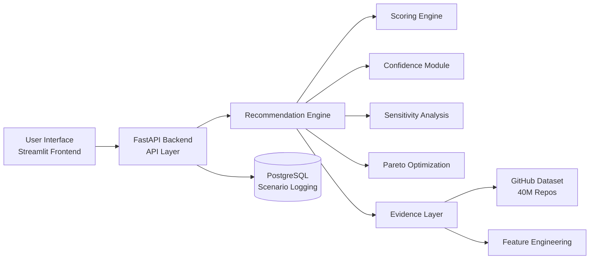

# **🚀 StackWise-AI**

  

### **AI-Powered Tech Stack Decision Intelligence System**


----------

# **📌 Overview**

  

**StackWise-AI**  is a  **decision intelligence platform**  that recommends optimal technology stacks for software projects using:

-   Real-world GitHub repository data (40M+ dataset)
    
-   Multi-factor scoring models
    
-   Confidence estimation
    
-   Sensitivity analysis
    
-   Pareto optimization
    

  

It helps developers move from:

  

❌ “Guessing a stack”

➡️ to

✅ “Making data-driven architectural decisions”

----------

# **🎯 Key Features**

  

## **🧠 Intelligent Recommendation Engine**

-   Language selection based on project context
    
-   Backend framework suggestion
    
-   Database recommendation
    
-   Deployment strategy selection
    

----------

## **📊 Data-Driven Insights**

-   Uses real GitHub ecosystem signals
    
-   Popularity, maturity, activity, ecosystem strength
    
-   Evidence-based scoring
    

----------

## **📈 Confidence Scoring**

-   Measures reliability of recommendation
    
-   Based on:
    
    -   score gap
        
    -   dataset evidence
        
    -   team alignment
        
    

----------

## **🔍 Sensitivity Analysis**

-   Tests robustness of decision
    
-   Shows:
    
    -   what changes the winner
        
    -   how stable the recommendation is
        
    

----------

## **⚖️ Pareto Frontier**

-   Identifies **non-dominated solutions**
    
-   Helps understand trade-offs:
    
    -   performance vs ecosystem
        
    -   simplicity vs scalability
        
    

----------

## **💾 Scenario Persistence (PostgreSQL)**

-   Save recommendation scenarios
    
-   Track historical decisions
    
-   Enable future analytics
    

----------

## **🌐 Full-Stack System**

-   FastAPI backend (production-ready)
    
-   Streamlit frontend (interactive UI)
    
-   PostgreSQL logging layer
    

----------

# **🏗️ System Architecture**



----------

# **🧱 Project Structure**

```
StackWise-AI/
├── backend/          # FastAPI API layer
├── frontend/         # Streamlit UI
├── engine/           # Core recommendation engine
├── evidence/         # Dataset-driven signals
├── database/         # PostgreSQL logging
├── pipelines/        # Data processing scripts
├── catalog/          # Stack mappings (YAML/JSON)
├── core/             # Legacy / modular logic
├── tests/            # Unit tests
├── data/             # Raw + processed data
```

----------

# **⚙️ Tech Stack**

  

## **🔹 Backend**

-   FastAPI
    
-   Pydantic
    
-   Uvicorn
    

  

## **🔹 Frontend**

-   Streamlit
    
-   Requests
    

  

## **🔹 Data Processing**

-   Polars
    
-   Pandas
    
-   DuckDB
    
-   PyArrow
    

  

## **🔹 Database**

-   PostgreSQL
    
-   psycopg2
    

  

## **🔹 ML/Scoring**

-   Custom scoring engine
    
-   Dataset-driven signals
    

  

## **🔹 Dev Tools**

-   Pytest
    
-   Ruff
    
-   GitHub Actions (optional)
    

----------

# **🚀 Getting Started**

  

## **1️⃣ Clone Repository**

```
git clone https://github.com/your-username/StackWise-AI.git
cd StackWise-AI
```

----------

## **2️⃣ Create Virtual Environment**

```
python -m venv venv
source venv/bin/activate   # Mac/Linux
venv\Scripts\activate      # Windows
```

----------

## **3️⃣ Install Dependencies**

```
pip install -r requirements.txt
```

----------

## **4️⃣ Setup PostgreSQL**

  

Create database:

```
CREATE DATABASE stackwise_ai;
```

Run schema:

```
psql -d stackwise_ai -f database/schema.sql
```

----------

## **5️⃣ Run Backend**

```
uvicorn backend.main:app --reload
```

Open:

  

👉 http://127.0.0.1:8000/docs

----------

## **6️⃣ Run Frontend**

```
streamlit run frontend/app.py
```

Open:

  

👉 http://localhost:8501

----------

# **🧪 Example API Request**

```
{
  "project_type": "api",
  "team_languages": ["python"],
  "low_ops": true,
  "expected_scale": "medium"
}
```

----------

# **📤 Example Response**

```
{
  "winner": {
    "language": "python",
    "backend_framework": "fastapi",
    "database": "postgresql",
    "deployment": "render",
    "score": 0.82
  },
  "confidence": 0.78,
  "sensitivity": {
    "stability": 0.67
  },
  "pareto": [
    {"language": "python"},
    {"language": "go"}
  ]
}
```

----------

# **🧠 How It Works**

  

### **1. Input Context**

-   Project type
    
-   Team skills
    
-   Scale requirements
    
-   Operational constraints
    

----------

### **2. Scoring Engine**

-   Weighted criteria:
    
    -   scalability
        
    -   cost
        
    -   ecosystem
        
    -   team fit
        
    

----------

### **3. Evidence Integration**

-   GitHub dataset signals:
    
    -   repo count
        
    -   forks
        
    -   watchers
        
    -   ecosystem strength
        
    

----------

### **4. Decision Intelligence Layer**

-   Confidence score
    
-   Sensitivity analysis
    
-   Pareto optimization
    

----------

# **🧪 Testing**

```
pytest
```

----------

# **📊 Future Improvements**

-   ML-based ranking (XGBoost)
    
-   Feedback learning loop
    
-   User authentication
    
-   Deployment (Docker + Cloud)
    
-   Analytics dashboard
    

----------

# **👨‍💻 Author**

  

**Aditya Singh**

----------

# **📄 License**

  

This project is licensed under the MIT License.

----------

# **⭐ Final Note**

  

This is not just a recommender system.

  

👉 It is a **Decision Intelligence Platform for Software Architecture**

----------


