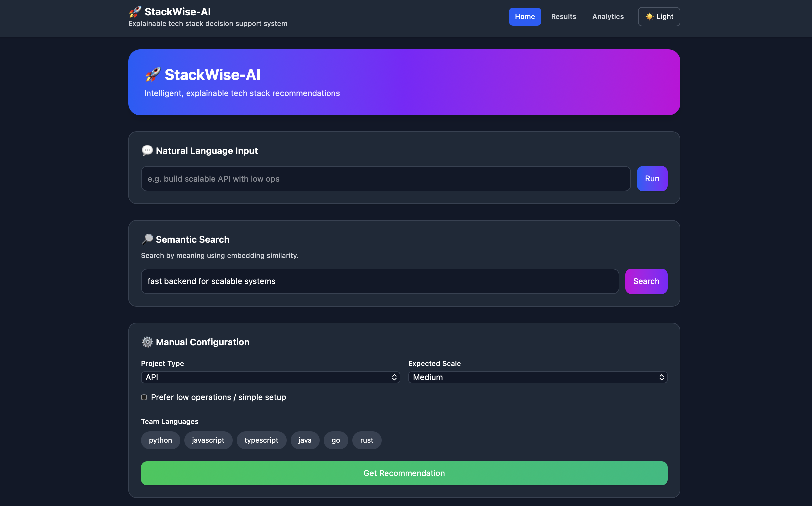
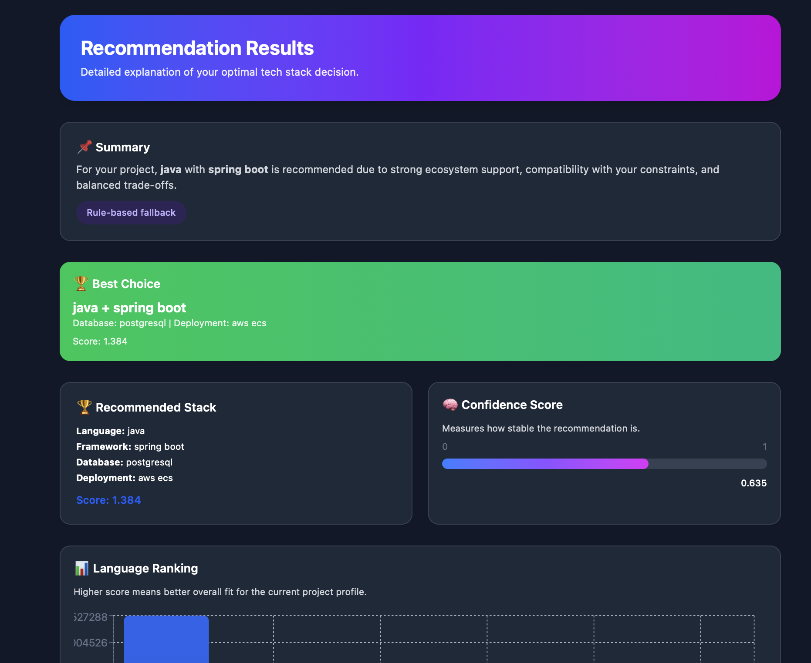
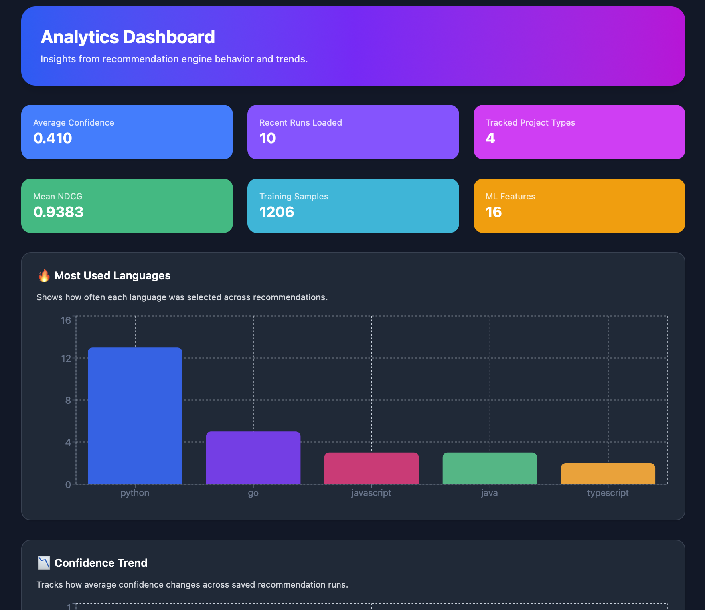

# **🚀 StackWise AI**

  

### **Explainable + ML-Powered Tech Stack Decision System**

<p align="center">
  
  
  
  
  
  
  
  
  
  
</p>


----------

# **📌 Overview**

  

**StackWise AI**  is an  **intelligent, explainable decision-support system**  that helps developers choose the optimal tech stack for their projects.

  

Unlike typical recommendation tools, it combines:

-   rule-based reasoning
    
-   ML-based ranking (LightGBM)
    
-   semantic search (embeddings)
    
-   explainability + trade-off analysis
    

  

👉 Result: **transparent, data-driven stack decisions instead of guesswork**

----------

# **🔥 Key Highlights**

-   🧠 **ML-powered ranking (LightGBM LambdaRank)**
    
-   🔎 **Semantic search using embeddings**
    
-   📊 **Explainable recommendations**
    
-   🔁 **Feedback-driven learning loop**
    
-   📈 **Analytics dashboard (NDCG, trends)**
    
-   ⚖️ **Pareto trade-off optimization**
    

----------

# **🎯 Problem Statement**

  

Choosing a tech stack is often:

-   intuition-based
    
-   trend-driven
    
-   inconsistent across teams
    

  

This leads to:

-   scalability issues
    
-   unnecessary complexity
    
-   poor architectural decisions
    

----------

👉 **StackWise AI solves this by turning stack selection into a structured, explainable, and learnable system.**

----------

# **🧠 Core Features**

  

## **🔹 1. ML-Based Recommendation Engine**

-   Uses **LightGBM ranking model**
    
-   Learns from feedback data
    
-   Optimizes ranking using  **NDCG**
    

----------

## **🔹 2. Explainable Decision Logic**

  

Each recommendation includes:

-   confidence score
    
-   explanation
    
-   trade-offs
    
-   alternative options
    

----------

## **🔹 3. Constraint-Based Filtering**

  

Filters stacks based on:

-   scalability needs
    
-   operational complexity
    
-   team expertise
    

----------

## **🔹 4. Semantic Search**

  

Search using natural language:

```
"fast backend for scalable systems"
```

Returns similar stack options using embeddings.

----------

## **🔹 5. Sensitivity Analysis**

  

Evaluates:

  

> “How stable is this recommendation if inputs change?”

----------

## **🔹 6. Pareto Frontier**

  

Identifies optimal trade-offs between:

-   performance
    
-   ecosystem
    
-   simplicity
    

----------

## **🔹 7. Feedback Learning Loop**

-   user feedback stored in PostgreSQL
    
-   training dataset generated
    
-   ML model retrained
    

----------

## **🔹 8. Analytics Dashboard**

  

Tracks:

-   recommendation trends
    
-   confidence scores
    
-   ML performance (NDCG)
    
-   usage patterns
    

----------

# **🏗️ System Architecture**

```mermaid
flowchart TD

    A[User<br>React UI] --> B[FastAPI Backend]

    B --> C[Recommendation Engine]

    C --> C1[Rule-based Candidate Generation]
    C --> C2[ML Ranking (LightGBM)]
    C --> C3[Confidence Calculation]
    C --> C4[Sensitivity Analysis]
    C --> C5[Pareto Optimization]

    C --> D[Semantic Search<br>(Embeddings)]

    C --> E[Evidence Layer]
    E --> E1[Language Signals]
    E --> E2[Catalog Config]

    B --> F[(PostgreSQL<br>Feedback + Runs)]

    F --> G[Training Data Pipeline]
    G --> H[Model Training]
```

----------

# **📂 Project Structure**

```
stackwise-ai/
├── backend/         # FastAPI API layer
├── frontend/        # React + TS UI
├── engine/
│   ├── ml/          # ML training + prediction
│   ├── similarity/  # semantic search
│   ├── scoring/     # rule-based logic
│   └── ...
├── evidence/        # dataset signals
├── database/        # PostgreSQL ops
├── pipelines/       # data + training pipelines
├── data/            # datasets
├── tests/           # API tests
```

----------

# **🖼️ Screenshots**

  

### **🏠 Home Page**



### **📊 Results Page**


### **📈 Analytics Dashboard**


----------

# **⚙️ Tech Stack**

  

## **Backend**

-   FastAPI
    
-   Pydantic
    
-   Uvicorn
    

  

## **Frontend**

-   React
    
-   TypeScript
    
-   Vite
    
-   Tailwind CSS
    
-   Recharts
    

  

## **ML & Data**

-   LightGBM (ranking)
    
-   Pandas
    
-   Polars
    
-   DuckDB
    
-   Sentence Transformers (embeddings)
    

  

## **Database**

-   PostgreSQL
    
----------

# **🚀 Getting Started**

  

## **1️⃣ Clone**

```
git clone https://github.com/your-username/StackWise-AI.git
cd StackWise-AI
```

----------

## **2️⃣ Backend Setup**

```
python -m venv venv
source venv/bin/activate
pip install -r requirements.txt
```

Run:

```
uvicorn backend.main:app --reload
```

👉 http://127.0.0.1:8000/docs

----------

## **3️⃣ Database Setup**

```
CREATE DATABASE stackwise_ai;
```

```
psql -d stackwise_ai -f database/schema.sql
```

----------

## **4️⃣ Frontend Setup**

```
cd frontend
npm install
npm run dev
```

👉 http://localhost:5173

----------

# **🧪 Example Request**

```
{
  "project_type": "api",
  "team_languages": ["python"],
  "low_ops": true,
  "expected_scale": "medium"
}
```

----------

# **📤 Example Output**

```
{
  "winner": {
    "language": "python",
    "backend_framework": "fastapi",
    "database": "postgresql",
    "deployment": "render",
    "score": 0.83
  },
  "confidence": 0.81,
  "ranking_source": "ml_model"
}
```

----------

# **📊 ML Evaluation**

```
GET /ml/evaluation
```

Returns:

```
{
  "ndcg": 0.82,
  "num_samples": 906,
  "num_features": 16
}
```

----------

# **📉 Current Limitations**

-   synthetic feedback data
    
-   limited stack catalog
    
-   basic embedding model
    

----------

# **🚀 Future Improvements**

-   real user feedback loop
    
-   advanced embeddings (OpenAI / Instructor)
    
-   hybrid ranking (rule + ML fusion)
    
-   cloud deployment (Docker + CI/CD)
    
-   user accounts + saved stacks
    

----------

# **👨‍💻 Author**

  

**Aditya Singh**

----------

# **📜 License**

MIT License

----------

# **⭐ Final Note**

  

This project demonstrates:

-   **ML system design (ranking + evaluation)**
    
-   **full-stack engineering**
    
-   **data pipeline + feedback loop**
    
-   **explainable AI principles**
    

