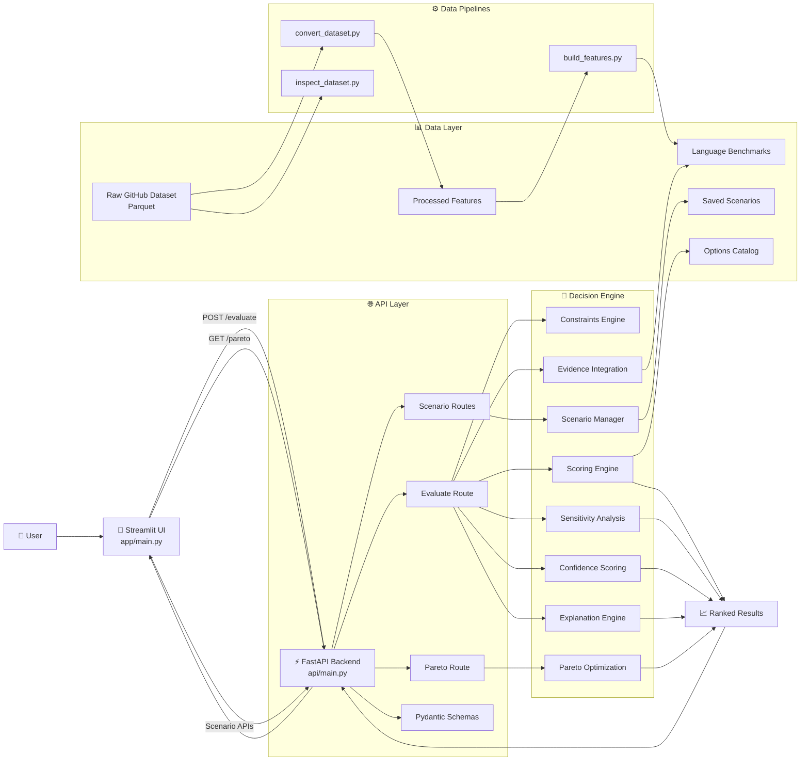

# **🚀 StackWise AI**

  

### **Explainable Decision Intelligence Platform for Architecture & Infrastructure Selection**

  

StackWise AI is a full-stack decision-analysis platform that helps engineers choose the optimal infrastructure stack using a combination of:

-   Constraint-based filtering
    
-   Weighted multi-criteria decision analysis (MCDA)
    
-   Sensitivity analysis
    
-   Pareto optimization
    
-   Confidence scoring
    
-   Data-driven ecosystem evidence
    

----------

## **⚡ Problem Statement**

  

Choosing the right infrastructure (e.g., ECS vs EKS vs Lambda) is complex and often subjective.

  

StackWise AI transforms this into a:

  

> **Structured, explainable, and data-informed decision-making process**

----------

## **🧠 How It Works**

  

### **1. Input**

  

Users define:

-   Options (ECS, EKS, Lambda)
    
-   Constraints (Kubernetes, ops capacity, vendor neutrality)
    
-   Weights (cost, scalability, portability, etc.)
    

----------

### **2. Decision Engine**

  

The system evaluates options using:

-   ✅ Hard constraints (elimination)
    
-   ⚖️ Weighted scoring (MCDA)
    
-   📉 Penalty adjustments
    
-   📊 Evidence-based boosts (from GitHub dataset)
    
-   🔍 Sensitivity analysis
    
-   📈 Confidence estimation
    
-   🧠 Natural language explanation
    

----------

### **3. Output**

-   🏆 Ranked recommendations
    
-   🧾 Explanation (why this option wins)
    
-   🔍 Sensitivity insights
    
-   📊 Trade-off visualization
    
-   📈 Confidence score
    
-   ⚖️ Pareto frontier
    

----------

## **🏗️ Architecture**




----------

## **📂 Project Structure**

```
StackWise-AI/
├── api/                # FastAPI backend
├── app/                # Streamlit frontend
├── core/               # Decision engine logic
├── pipelines/          # Data processing pipelines
├── data/               # Raw + processed datasets
├── tests/              # Unit tests
├── catalog/            # Option definitions
├── requirements.txt
├── pyproject.toml
└── README.md
```


----------

## **🔧 Tech Stack**

  

### **Backend**

-   FastAPI
    
-   Pydantic
    

  

### **Frontend**

-   Streamlit
    
-   Plotly
    

  

### **Data Layer**

-   Polars
    
-   PyArrow
    
-   Parquet datasets (Hugging Face)
    

  

### **Core Logic**

-   Custom decision engine (MCDA)
    
-   Constraint-based filtering
    
-   Sensitivity analysis
    
-   Pareto optimization
    

  

### **Quality**

-   Pytest
    
-   Ruff (linting)
    

----------

## **📊 Dataset**

  

This project uses GitHub repository metadata:

  

👉 https://huggingface.co/datasets/ibragim-bad/github-repos-metadata-40M

  

Used for:

-   Ecosystem strength estimation
    
-   Language popularity signals
    
-   Evidence-based scoring adjustments
    

----------

## **🚀 Running the Project**

  

### **1️⃣ Setup Environment**

```
python -m venv venv
source venv/bin/activate  # Mac/Linux
pip install -r requirements.txt
```

----------

### **2️⃣ Run Backend**

```
uvicorn api.main:app --reload
```

API Docs:

```
http://127.0.0.1:8000/docs
```

----------

### **3️⃣ Run Frontend**

```
streamlit run app/main.py
```

----------

## **🧪 Example API Request**

```
{
  "options": ["ECS", "EKS", "Lambda"],
  "constraints": {
    "need_kubernetes": true,
    "low_ops_capacity": false,
    "vendor_neutrality": false
  },
  "weights": {
    "cost": 0.2,
    "scalability": 0.3,
    "portability": 0.2,
    "ops_simplicity": 0.15,
    "time_to_market": 0.15
  }
}
```

----------

## **🧪 Testing**

  

Run tests:

```
pytest
```

Covers:

-   Scoring logic
    
-   Pareto correctness
    
-   Confidence computation
    

----------

## **🔍 Key Features**

  

### **✅ Explainable Decisions**

  

Clear reasoning for every recommendation.

  

### **📉 Sensitivity Analysis**

  

Understand how weight changes affect outcomes.

  

### **⚖️ Pareto Frontier**

  

Avoid dominated (inferior) solutions.

  

### **📈 Confidence Score**

  

Measures reliability of the decision.

  

### **💾 Scenario Saving**

  

Store and reload decision scenarios.

  

### **📊 Data-Driven Evidence**

  

Uses real GitHub data to adjust scores.

----------

## **💡 Why This Project Stands Out**

  

Unlike basic comparison tools, StackWise AI:

-   Combines **system design + data engineering + AI reasoning**
    
-   Uses **explainable decision modeling (not black-box ML)**
    
-   Handles **large-scale datasets efficiently (Polars + Parquet)**
    
-   Provides **production-style API + interactive UI**
    

----------

## **🎯 Use Cases**

-   Infrastructure selection (ECS vs EKS vs Lambda)
    
-   Technology stack decisions
    
-   Architecture trade-off analysis
    
-   Engineering decision support systems
    

----------

## **🚀 Future Improvements**

-   ML-based scoring refinement
    
-   Embedding-based architecture recommendations
    
-   Multi-domain expansion (databases, APIs, cloud vendors)
    
-   User authentication + saved dashboards
    
-   Deployment (Docker + cloud hosting)
    

----------

## **👨‍💻 Author**

  

Aditya Singh

----------

## **⭐ If you found this useful**

  

Give this repo a ⭐ — it helps a lot!

----------


